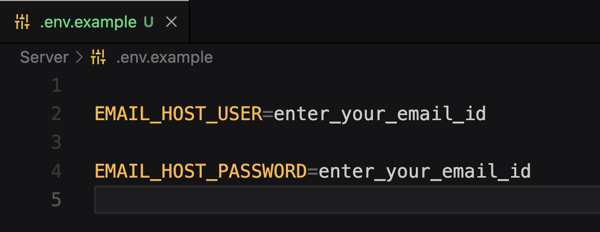

## Non-Cognisible Offense Records System

<!-- The basic aim for implementing Restaurant Seat Reservation system is to eliminate the waiting time for the customers at restaurant for waiting for their turn for the service. This system would allow customers to view different restaurants listed on the application, and view the food offered; also reserve seats at any date and time according to their convenience and also pay in advance for the service they which they opted for. The Restaurant owners also get an interface to update the seats reservations and their services, also auto-generate invoice for the customers.
Customer authentication is done using *JWT (JSON Web Token)*. Database used is *SQLite3* which is django's default database. Payment Gateway used is *Razorpay*. -->

### 🔗 Content

- [Overview](#non-cognisible-offense-records-system)
- [Content](#-content)
- [Event Overview](#-event-overview)
- [Team](#-team)
- [Problem Statement](#-problem-statement)
- [Features](#-features)
- [Tech Stack](#-tech-stack)
- [API Reference](#-api-reference)
- [Environment Variables](#-environment-variables)
- [Run Locally](#-run-locally)
- [Documentation](#-documentation)
- [Screen-Shots](#-screen-shots)
- [Author](#-author)


### 🧬 Event Overview

<!-- Me and my team participated in our first ever Hackathon event at [Inspirus](https://www.linkedin.com/feed/hashtag/?keywords=inspirus2k21) in October 2021 at [Don Bosko College of Engineering, Goa](https://www.linkedin.com/school/don-bosco-college-of-engineering-fatorda-goa/). 
Me along with [Akash Sanjeev](https://www.linkedin.com/in/akash-sanjeev-37436a1b5/) and [Sachin Padwalkar](https://www.linkedin.com/in/sachin-padwalkar-a265291ba/) had participated as a team, where I was working on [Django application](https://github.com/atharvparkhe/restaurant-seat-booking) (Backend), Saching was handling [React application](https://github.com/Sachin9822/restu) (Frontend) for the Administration Section and Akash was handling [Androind application](https://github.com/AkashCSanjeev/Be-Seated) (Frontend). -->


### 👨‍👦‍👦 Team

- `Atharva Parkhe` -  Django Developer (Backend)  -  *Python* -   [LinkedIn](https://www.linkedin.com/in/atharva-parkhe-3283b2202/), [GitHub](https://github.com/atharvparkhe)

- `Sachin Padwalkar` -  Android Developer (Frontend) *Java* - [LinkedIn](https://www.linkedin.com/in/sachin-padwalkar-a265291ba/), [GitHub](https://github.com/Sachin9822)

- `Ruthveek Desai` -  Android Developer (Frontend) *Java* - [LinkedIn](https://www.linkedin.com/in/ruthveekdessai/), [GitHub](https://github.com/DessaiRuthveek)

- `Aniket Mandrekar` - Facial Recognision and Data Scraping (Backend) *Python* - [LinkedIn](https://www.linkedin.com/in/ruthveekdessai/)


### 📃 Problem Statement


### 📋 Features

- **USER AUTHENTICATION :** Users can Signup for a new account, Verify thier email id, Login using email and password, make a Forgot request to reset thier password. 

- **RESTAURANTS :** Users can view all restaurants listed on the app.

- **BOOKING :** User can make booking by selecting time-slots for a perticular service as per users choice.

- **SELLER AUTHENTICATION :** Seller (Shop-keepers) can Signup for a new account, Verify thier email id, Login using email and password, make a Forgot request to reset thier password. 

- **SELLER CMS :** Seller can manage thier content on the site. They can add, modify, delete thier online shop and the products that they sell in thier shop.

- **SELLER ORDER MANAGEMENT :** Seller can manage thier orders through the dashboard.


### 🧰 Tech Stack

- **`BACKEND`** : Django *(Python)*

- **`DATABASE`** : SQLite3

- **`FRONTEND`** : 
    - **Admin Panel :** React JS *(Javascript)*
    - **Customer Application :** Android *(Java)*


### 🛠 API Reference

**Postman Endpoints** : https://www.getpostman.com/collections/66bf66e50ebe0f8f60c3


**API Endpoints JSON file** (for importing into thunderclient / postman) is available in the docs folder or click [here](docs/endpoints.json)


### 🔐 Environment Variables

To run this project, you will need to add the following environment variables to your **.env** file

- `EMAIL_ID`  -  Email ID (which would be used to send emails)

- `EMAIL_PW`  -  Email Password




### 💻 Run Locally

***Step#1 : Clone Project Repository***

```bash
git clone https://github.com/atharvparkhe/https://github.com/atharvparkhe/Goa-Police-Hackathon-2022.git && cd https://github.com/atharvparkhe/Goa-Police-Hackathon-2022/server/
```

***Step#2 : Create Virtual Environment***

- If *virtualenv* is not istalled :
```bash
pip install virtualenv && virtualenv env
```
- **In Windows :**
```bash
    env/Scripts/activate
```
- **In Linux or MacOS :**
```bash
    source env/bin/activate
```

***Step#3 : Install Dependencies***

```bash
pip install --upgrade pip -r requirements.txt
```

***Step#4 : Add .env file***

- ENV file contents
    - **In Windows :**
    ```bash
        copy .env.example .env
    ```
    - **In Linux or MacOS :**
    ```bash
        cp .env.example .env
    ```
- Enter Your Credentials in the *".env"* file. Refer [Environment Variables](#-environment-variables)

***Step#5 : Run Server***

```bash
python manage.py runserver
```

- Open `http://127.0.0.1:8000/` or `http://localhost:8000/` on your browser.

*Check the terminal if any error.*

***Step#6 : Run Android App***

*Step#6(i) : Police App*

```bash
    https://github.com/atharvparkhe/Goa-Police-Hackathon-2022/app/
```

  *Step#6(ii) : Police Admin App*

```bash
    https://github.com/atharvparkhe/Goa-Police-Hackathon-2022/admin/
```

***Step#7 : Open folder in Android Studio***

***Step#8 : Select any Pixel Device as simulator***

***Step#9 : Press Build/Run Project Button***


### 📄 Documentation

The docs folder contain all the project documentations and screenshots of the project.You can go through the presentation [here](presentaion.pptx)

- **Local Server Base Link :** http://localhost:8000/

- **Admin Pannel Access :**
    - ***Email :*** "admin@admin.com"
    - ***Password :*** "password"


### 🌄 Screen-Shots

- **Authentication**


- **Main**


### 🙋🏻‍♂️ Author

**🤝 Connect with Atharva Parkhe**

[](https://www.linkedin.com/in/atharva-parkhe-3283b2202/)
[](https://www.github.com/atharvparkhe/)
[](https://www.twitter.com/atharvparkhe/)
[](https://www.instagram.com/atharvparkhe/)
[](https://leetcode.com/patharv777/)
[](https://www.youtube.com/channel/UChimOJO64hOqtE7HCgtiIig)
[](https://discord.gg/8WNC43Xsfc)